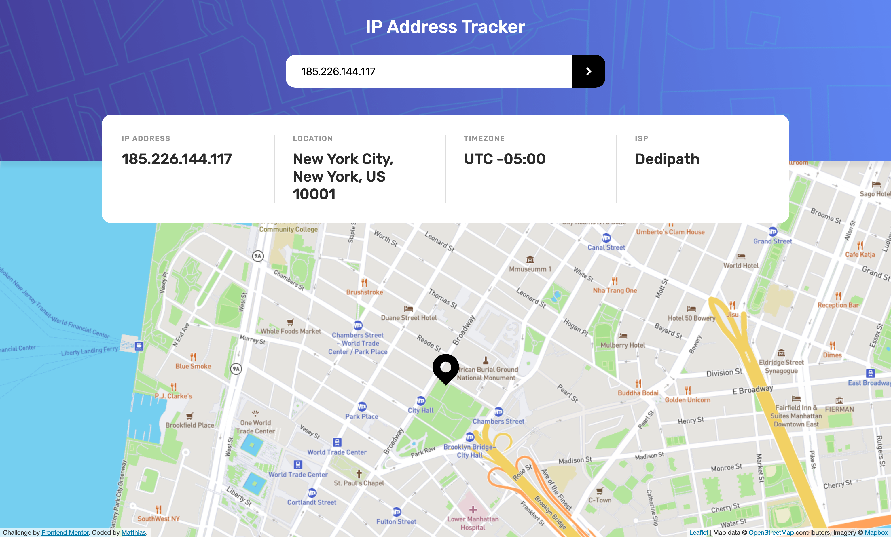

# Frontend Mentor - IP Address Tracker solution

This is a solution to the [IP Address Tracker challenge on Frontend Mentor](https://www.frontendmentor.io/challenges/ip-address-tracker-I8-0yYAH0). Frontend Mentor challenges help you improve your coding skills by building realistic projects. 

## Table of contents

- [Overview](#overview)
  - [The challenge](#the-challenge)
  - [Screenshot](#screenshot)
  - [Links](#links)
- [My process](#my-process)
  - [Built with](#built-with)
- [Author](#author)

## Overview

### The challenge

Users should be able to:

- View the optimal layout for each page depending on their device's screen size
- See hover states for all interactive elements on the page
- See their own IP Address on the map on the initial page load
- Search for any IP addresses or domains and see the key information and location
- See a loading state when the API is fetching data
- See an error state when the API fails to return successfully

### Screenshot

### Links

<!-- - Solution URL: [Add solution URL here](https://your-solution-url.com) -->
- Live Site URL: [IP Address Tracker](https://ip-address-tracker-matthiassmith.vercel.app/)

## My process

### Built with

- Mobile-first workflow
- [React](https://reactjs.org/) - JS library
- [Styled Components](https://styled-components.com/) - For styles
- [IP Geolocation API by IPify](https://geo.ipify.org/) - For IP Address info
- [LeafletJS](https://leafletjs.com/) - For mapping
- [Mapbox](https://www.mapbox.com/) and [OpenStreetMap](https://www.openstreetmap.org/) - For map images

## Author

- Frontend Mentor - [@MatthiasSmith](https://www.frontendmentor.io/profile/MatthiasSmith)
